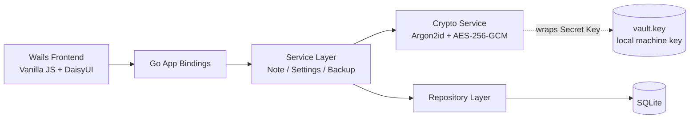
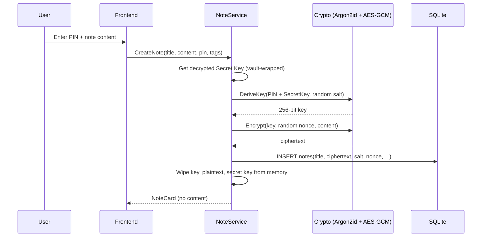

# SafeNote

Offline, encrypted note-taking desktop app. Every note is protected with
AES-256-GCM, keyed by an Argon2id derivation of a user-defined Secret Key
combined with a per-note PIN. No plaintext note content, PIN, or derived
key is ever persisted.

## Stack

- **Backend**: Go 1.24+, Wails v2, SQLite (`modernc.org/sqlite`)
- **Frontend**: Vanilla HTML/CSS/JS (hash-router SPA), TailwindCSS + DaisyUI
- **Crypto**: AES-256-GCM, Argon2id (`golang.org/x/crypto`)

## Architecture



## Encryption flow (create/open a note)



## Project layout

```
SafeNote/
  main.go               entry point (must stay at project root for `wails build`)
  internal/
    crypto/              AES-256-GCM, Argon2id KDF, memory wipe, vault key
    domain/              entities + sentinel errors
    repository/           SQLite access, migrations
    service/               note/settings/backup business logic, lockout, validation
    app/                    Wails-bound App struct (frontend-facing API)
  frontend/
    src/pages/             one module per screen (splash, home, create, ...)
    src/components/        layout, PIN modal
    src/api.js               thin wrapper over window.go.app.App
  docs/ADR.md               key architecture decisions and trade-offs
  scripts/                   build.sh / build.ps1
```

> **Note**: `main.go` lives at the project root, not in a `cmd/` folder.
> Wails v2's CLI (binding generator, `wails build`/`wails dev`) expects to
> find `package main` alongside `wails.json`; moving it elsewhere causes
> a `no go file in ..` error during binding generation.

## Getting started

See [INSTALL.md](./INSTALL.md) for full setup, build, and packaging
instructions across Windows, Linux, and macOS.

Quick start (once Go, Node, and the Wails CLI are installed):

```bash
go mod tidy
cd frontend && npm install && cd ..
wails dev
```

## Input validation

Enforced in `internal/service/validation.go` (backend, cannot be bypassed
via devtools) and mirrored in the frontend for instant feedback:

- **PIN**: exactly 6 numeric digits (`^\d{6}$`)
- **Title**: required, max 75 characters (rune-counted)
- **Tags**: each tag max 25 characters

## Security notes

- Read [docs/ADR.md](./docs/ADR.md) for the reasoning behind each
  security-relevant design decision (per-note KDF, plaintext title
  trade-off, vault-key wrapping, generic unlock errors, lockout scope).
- This scaffold was generated without a Go toolchain available in the
  generation environment, so it has **not** been compiled or run here.
  Run `go build ./...` and `go test ./...` locally before relying on it.
